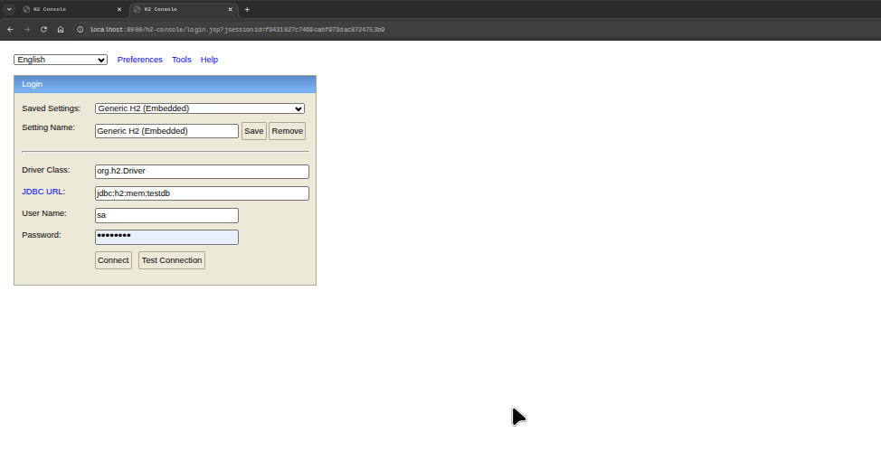
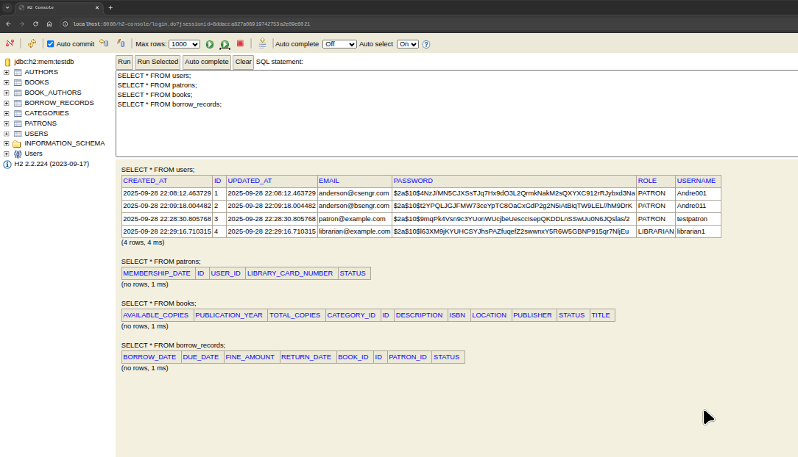

# Library Management System API

A comprehensive backend API for managing library operations including book inventory, patron management, borrowing system, and reporting. Built as a learning project to demonstrate Spring Boot, REST API design, and enterprise Java development practices.

## Features

### Core Functionality
- **Book Management**: CRUD operations for books with categories and authors
- **Patron Management**: Register and manage library patrons with unique library card numbers
- **User Authentication**: Secure registration and login system
- **Borrowing System**: Check-out, return, and track borrowed books with due dates
- **Authentication & Authorization**: JWT-based authentication with role-based access (LIBRARIAN/PATRON)
- **Fine Management**: Automatic calculation of overdue fines
- **Audit Logging**: Track security events and user activities
- **Email Notifications**: Automated notifications for due dates and overdue books

### Business Rules
- Patrons can borrow up to 5 books simultaneously
- Books can be borrowed for 14 days with automatic due date calculation
- Late returns incur fines ($1 per day)
- Books with "RARE" category cannot be borrowed
- Patrons with overdue books cannot borrow new books
- Unique library card numbers generated automatically
- Password encryption using BCrypt

## Tech Stack

- **Java 17**
- **Spring Boot 3.2.0**
- **Spring Security** + **JWT Authentication**
- **Spring Data JPA** with Hibernate
- **H2 Database** (development) / **PostgreSQL** (production)
- **Maven** for dependency management
- **Jackson** for JSON serialization
- **Bean Validation** for input validation
- **SLF4J** + **Logback** for logging

## Database Schema

### Core Entities
- **Users**: Authentication and basic user information
- **Patrons**: Library-specific user data with card numbers
- **Books**: Book inventory with ISBN, categories, and availability
- **Authors**: Author information linked to books
- **Categories**: Book categorization system
- **BorrowRecords**: Track borrowing history and current loans
- **Fines**: Overdue fine calculations and payments

## API Endpoints

### Authentication
```http
POST /api/auth/register  # Register new user
POST /api/auth/login     # User login (returns JWT token)
GET  /api/auth/test      # Test endpoint connectivity
```

### Books
```http
GET    /api/books                 # Get all books (paginated) - LIBRARIAN/PATRON
GET    /api/books/{id}            # Get book by ID - LIBRARIAN/PATRON  
GET    /api/books/search          # Search books (public)
POST   /api/books                 # Add new book - LIBRARIAN only
PUT    /api/books/{id}            # Update book - LIBRARIAN only
DELETE /api/books/{id}            # Delete book - LIBRARIAN only
```

### Patrons
```http
GET    /api/patrons               # Get all patrons - LIBRARIAN only
GET    /api/patrons/{id}          # Get patron by ID - LIBRARIAN
PUT    /api/patrons/{id}          # Update patron profile - LIBRARIAN
DELETE /api/patrons/{id}          # Delete patron - LIBRARIAN
GET    /api/patrons/active        # Get active patrons - LIBRARIAN
```

### Borrowing
```http
POST   /api/borrow/{bookId}/patron/{patronId}   # Borrow book - LIBRARIAN/PATRON
POST   /api/return/{bookId}/patron/{patronId}   # Return book - LIBRARIAN/PATRON  
GET    /api/borrow/patron/{patronId}            # Get patron's borrowed books - LIBRARIAN/PATRON
GET    /api/borrow/overdue                      # Get overdue books - LIBRARIAN
```

### Authors & Categories
```http
GET    /api/authors               # Get all authors - LIBRARIAN
POST   /api/authors               # Create author - LIBRARIAN
PUT    /api/authors/{id}          # Update author - LIBRARIAN
DELETE /api/authors/{id}          # Delete author - LIBRARIAN

GET    /api/categories            # Get all categories - LIBRARIAN
POST   /api/categories            # Create category - LIBRARIAN  
PUT    /api/categories/{id}       # Update category - LIBRARIAN
DELETE /api/categories/{id}       # Delete category - LIBRARIAN
```

## Getting Started

### Prerequisites
- Java 17 or higher
- Maven 3.6+
- Git

### Installation & Setup

1. **Clone the repository**
   ```bash
   git clone https://github.com/yourusername/library-management-system.git
   cd library-management-system
   ```

2. **Configure the application**
   ```bash
   # The application uses H2 in-memory database by default
   # No additional configuration needed for development
   ```

3. **Build and run**
   ```bash
   mvn clean install
   mvn spring-boot:run
   ```

4. **Access the application**
   - API Base URL: `http://localhost:8080/api`
   - H2 Console: `http://localhost:8080/h2-console`
   - Health Check: `http://localhost:8080/actuator/health`

### Database Console
The application includes H2 database web console for development:



**Connection Settings:**
- JDBC URL: `jdbc:h2:mem:testdb`
- Username: `sa`
- Password: `password`



View sample data:


### Sample API Usage

**Register a new patron:**
```bash
curl -X POST http://localhost:8080/api/auth/register \
  -H "Content-Type: application/json" \
  -d '{
    "username": "john_doe",
    "email": "john@example.com",
    "password": "securePassword123",
    "firstName": "John",
    "lastName": "Doe",
    "role": "PATRON"
  }'
```

**Login and get JWT token:**
```bash
curl -X POST http://localhost:8080/api/auth/login \
  -H "Content-Type: application/json" \
  -d '{
    "username": "john_doe",
    "password": "securePassword123"
  }'
```

**Access protected endpoints:**
```bash
curl -X GET http://localhost:8080/api/books \
  -H "Authorization: Bearer YOUR_JWT_TOKEN_HERE"
```

## Configuration

The application supports different profiles:

### Development (default)
- H2 in-memory database
- Debug logging enabled
- H2 console accessible

### Production
- PostgreSQL database
- Optimized logging
- Enhanced security settings

Environment variables:
```bash
DB_USERNAME=your_db_user
DB_PASSWORD=your_db_password  
JWT_SECRET=your_jwt_secret_key
MAIL_USERNAME=your_email@gmail.com
MAIL_PASSWORD=your_app_password
```

## Security Features

- **JWT Authentication**: Stateless authentication with configurable expiration
- **Role-Based Access Control**: LIBRARIAN and PATRON roles with different permissions
- **Password Encryption**: BCrypt password hashing
- **CORS Configuration**: Configurable cross-origin resource sharing
- **Security Event Logging**: Track authentication and authorization events
- **Input Validation**: Comprehensive request validation

## Testing

### Manual Testing
- Use Postman, Insomnia, or curl for API testing
- H2 console for database verification
- Actuator endpoints for health monitoring

### Automated Testing
```bash
mvn test                    # Run unit tests
mvn integration-test        # Run integration tests (when implemented)
mvn jacoco:report          # Generate code coverage report
```

## Project Structure

```
src/main/java/com/library/
├── config/          # Configuration classes
├── controller/      # REST controllers
├── dto/            # Data transfer objects
├── entity/         # JPA entities
├── exception/      # Custom exceptions and handlers
├── repository/     # Data access layer
├── security/       # Security configurations and JWT utilities
├── service/        # Business logic layer
└── validation/     # Custom validators and validation logic
```

## Learning Objectives Achieved

This project demonstrates proficiency in:
- **Spring Boot Application Architecture**
- **RESTful API Design Principles**
- **Spring Security Implementation**
- **JWT Authentication & Authorization**
- **JPA/Hibernate ORM Mapping**
- **Input Validation & Error Handling**
- **Database Design & Relationships**
- **Logging & Monitoring**
- **Maven Dependency Management**

## Future Enhancements

- [ ] Implement comprehensive unit and integration tests
- [ ] Add API documentation with Swagger/OpenAPI
- [ ] Implement book reservation system
- [ ] Add advanced search and filtering
- [ ] Create admin dashboard endpoints
- [ ] Implement rate limiting
- [ ] Add caching for frequently accessed data
- [ ] Integrate with external book APIs

## Contributing

This is a learning project, but feedback and suggestions are welcome! Please feel free to:
- Open issues for bugs or enhancement suggestions
- Submit pull requests for improvements
- Provide code review comments

## License

This project is for educational purposes. Feel free to use it as a reference for your own learning journey.

---

**Note**: This is a learning project demonstrating Spring Boot and REST API development concepts. It includes security features but should not be used in production without additional security hardening and testing.
